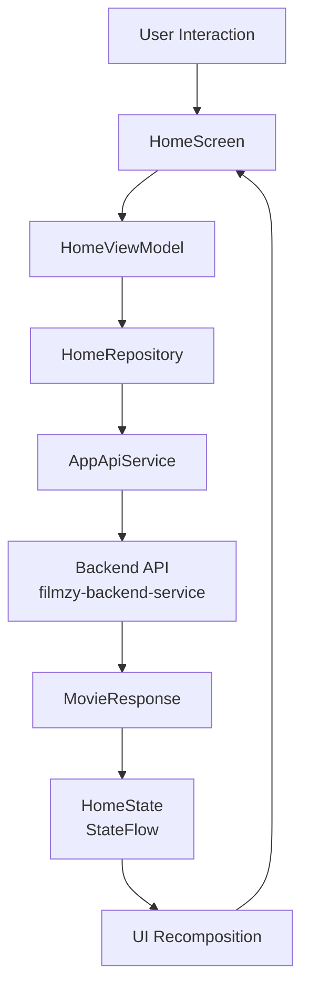
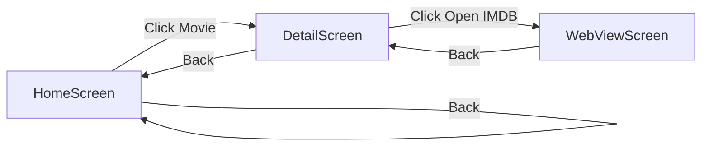

# SoliteckTask App Documentation

## Project Overview

**SoliteckTask** is an Android movie streaming application built with modern Android architecture patterns and best practices. The app displays trending movies, popular content, and top-rated films across different categories using a backend API.

### Key Technologies

- **Language**: Kotlin
- **UI Framework**: Jetpack Compose (Material Design 3)
- **Dependency Injection**: Hilt
- **Networking**: Retrofit + OkHttp
- **Image Loading**: Coil
- **Navigation**: Jetpack Navigation Compose
- **Serialization**: Kotlinx Serialization
- **Min SDK**: 24 (Android 7.0)
- **Target SDK**: 35 (Android 15)

---

## Architecture Overview

The app follows the **Clean Architecture** pattern with clear separation of concerns:

```
Presentation Layer (UI)
    ↓
Domain Layer (Use Cases)
    ↓
Data Layer (Repository & API)
```

### Layer Breakdown

**Presentation Layer** (`presentation/`)
- UI components and screens built with Jetpack Compose
- ViewModels for state management
- Navigation handling

**Domain Layer** (`domain/`)
- Repository interfaces defining contracts
- Business logic abstraction

**Data Layer** (`data/`)
- API service definitions using Retrofit
- Data models and DTOs
- Repository implementations

---

## Project Structure

```
app/src/main/java/com/savebytes/solitecktask/
├── data/
│   ├── api/
│   │   └── AppApiService.kt          # Retrofit API endpoints
│   ├── models/
│   │   ├── MovieResponse.kt          # API response wrapper
│   │   ├── Data.kt                   # Main data container
│   │   └── MovieItem.kt              # Individual movie model
│   └── repository/
│       └── HomeRepository.kt         # API data fetching logic
├── domain/
│   └── repo/
│       └── HomeRepo.kt               # Repository interface
├── presentation/
│   ├── navigation/
│   │   ├── AppNavigation.kt          # Navigation graph setup
│   │   └── Screens.kt                # Screen route definitions
│   ├── screens/
│   │   ├── HomeScreen.kt             # Main feed screen
│   │   ├── DetailScreen.kt           # Movie details screen
│   │   └── WebViewScreen.kt          # IMDB web viewer
│   ├── viewmodels/
│   │   └── HomeViewModel.kt          # State management
│   ├── states/
│   │   └── HomeState.kt              # UI state model
│   └── theme/
│       ├── Color.kt                  # Color palette
│       ├── Theme.kt                  # Material theme setup
│       └── Type.kt                   # Typography definitions
├── di/
│   ├── AppModule.kt                  # API & HTTP client setup
│   └── HomeRepoModule.kt             # Repository binding
├── utils/
│   └── Resource.kt                   # Generic data wrapper
├── MainActivity.kt                   # Entry point
└── SoliteckTaskApplication.kt        # Hilt application class
```

---

## Data Flow Architecture



---

## Screen Navigation Flow



---

## API Integration

### Base URL
```
https://filmzy-backend-service.onrender.com
```

### Endpoints

**GET** `/film/home`
- Returns trending, popular, and top-rated movies
- Response structure:
```json
{
  "status": 200,
  "message": "Success",
  "data": {
    "genres": ["Action", "Drama", ...],
    "trending": [...],
    "popularMovies": [...],
    "popularTvSeries": [...],
    "topRatedMovies": [...],
    "topRatedTvSeries": [...]
  }
}
```

### HTTP Configuration

- **OkHttp Logging**: Enabled with `BODY` level for debugging
- **Timeout**: Uses default Retrofit/OkHttp settings
- **Converter**: Gson for JSON serialization/deserialization

---

## State Management

### HomeState
```kotlin
data class HomeState(
    val demo: String = "Demo Value",
    val isNetworkCallSuccessful: Boolean = false,
    val movieHomeData: Data = Data(),
    val isLoading: Boolean = true
)
```

### State Flow
- Uses `MutableStateFlow` in ViewModel
- Exposed as `StateFlow` for UI consumption
- Collected in Compose using `collectAsState()`

---

## Dependency Injection

### Hilt Setup

1. **AppModule** - Provides:
   - Application Context
   - OkHttpClient with logging interceptor
   - Retrofit instance with Gson converter
   - AppApiService

2. **HomeRepoModule** - Binds:
   - HomeRepository implementation to HomeRepo interface

### Usage
```kotlin
@HiltViewModel
class HomeViewModel @Inject constructor(
    private val homeRepo: HomeRepo
) : ViewModel()
```

---

## Key Components Explained

### HomeViewModel
Responsible for:
- Fetching movie data on initialization
- Managing loading and error states
- Exposing state as StateFlow to UI

### HomeScreen
Displays:
- Trending movies carousel
- Genre tags in staggered grid
- Popular/Top-rated movies and TV series
- Loading indicator during API calls

### DetailScreen
Shows:
- Movie poster image
- Rating and release year
- Full description
- Open IMDB button to view full details

### WebViewScreen
- Embedded WebView for IMDB links
- Loading progress indicator
- Back navigation

---

## Resource Wrapper Pattern

```kotlin
data class Resource<out T>(
    val status: Status,
    val data: T?,
    val message: String?
)

enum class Status { SUCCESS, ERROR, LOADING }
```

Provides standardized handling of API responses with status tracking.

---

## UI Components

### Material Design 3
- Integrated Material3 library for modern UI
- Custom color scheme defined in `Color.kt`
- Typography system in `Type.kt`

### Compose Features Used
- `LazyColumn`, `LazyRow`, `LazyHorizontalStaggeredGrid` for efficient lists
- `AsyncImage` (Coil) for remote image loading
- `TopAppBar`, `Scaffold` for layout structure
- `CircularProgressIndicator` for loading states
- Custom composables: `RowSection`, `CardWithImage`, `TagItem`, `StaggeredTagGrid`

---

## Permissions

```xml
<uses-permission android:name="android.permission.INTERNET"/>
```

Required for API calls and WebView access.

---

## Build Configuration

- **Compile SDK**: 36
- **Min SDK**: 24
- **Target SDK**: 35
- **JVM Target**: 11
- **Proguard**: Disabled in release (can be enabled for production)

---


